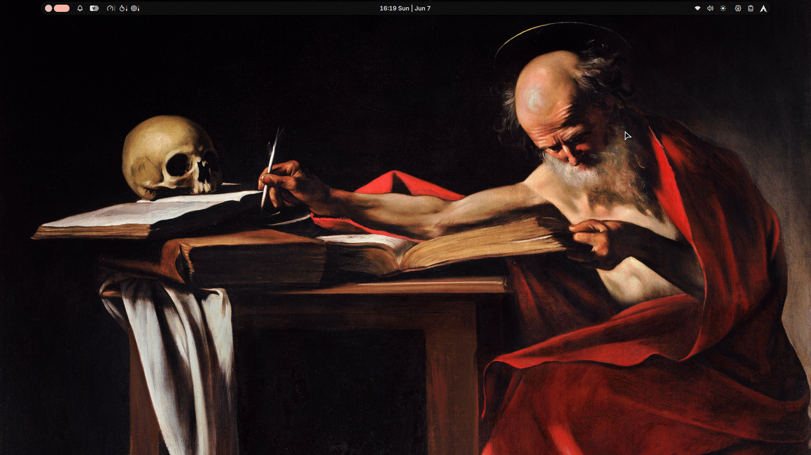
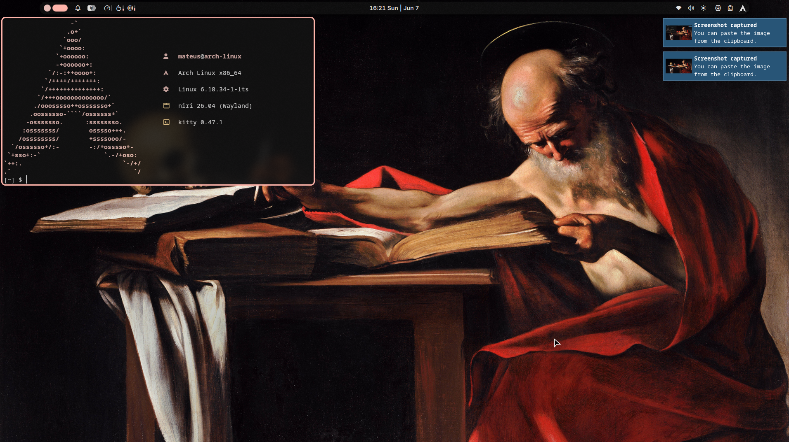

# 🏛️ State of The Arch

> "San Girolamo scrivendo" — Caravaggio (1605)

  
  

---

## 🛠️ System Info

| Component | Detail |
| :--- | :--- |
| **OS** | 🐧 Arch Linux |
| **Compositor (WM)** | 🌌 Niri |
| **Desktop Shell** | ⚡ Noctalia |
| **Emulador de Terminal**| 🐈 kitty |
| **App Launcher** | 🚀 fuzzle *(default)* |
| **File Manager**| 📁 Nautilus |

## 🎨 Customization

* **Color Scheme:** `M3 Rainbow` 
* **Icons:** Papirus Dark
* **Cursor:** Bibata Original Classic
* **Fonts:** * 🔤 Interface: `Inter`
  * 💻 Terminal/Code: `JetBrainsMono Nerd Font`

---

### 🖼️ Wallpaper
The wallpaer I used is **"San Girolamo scrivendo"** (Saint Jerome Writing), a baroque masterpiece of **Caravaggio** from 1605.
